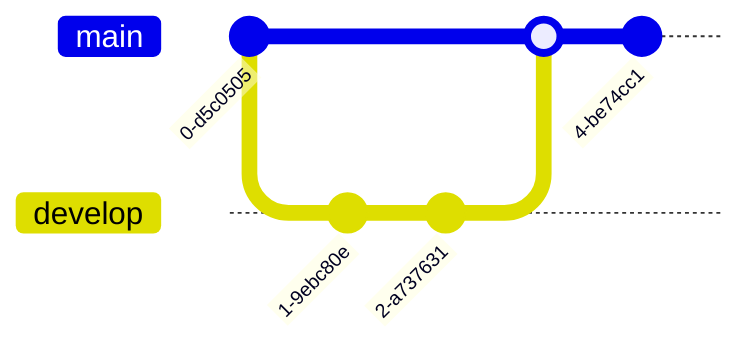

# Mermaid Diagrams Guide

This template includes full support for [Mermaid diagrams](https://mermaid.js.org/) - a powerful tool for creating diagrams and visualizations using simple text syntax.

## What is Mermaid?

Mermaid lets you create diagrams using markdown-like syntax. No need for external tools - just write the diagram code directly in your markdown files.

## Setup

Mermaid support is **already configured** in this template:

**In `docusaurus.config.ts`:**
```typescript
markdown: {
  mermaid: true,  // Mermaid enabled
},
themes: ["@docusaurus/theme-mermaid"],  // Mermaid theme loaded
```

**In `package.json`:**
```json
"@docusaurus/theme-mermaid": "3.9.2"
```

You're ready to use Mermaid diagrams immediately!

---

## Basic Syntax

Create diagrams using fenced code blocks with `mermaid` language:

````markdown

````

---

## Diagram Types & Examples

### 1. Flowcharts

**Use for:** Process flows, workflows, decision trees

````markdown

````

**Renders as:**


**Node Shapes:**
- `[Rectangle]` - Standard process
- `(Round edges)` - Start/End
- `{Diamond}` - Decision
- `[(Database)]` - Database
- `((Circle))` - Connection point

**Direction:**
- `TD` or `TB` - Top to bottom
- `LR` - Left to right
- `RL` - Right to left
- `BT` - Bottom to top

### 2. Sequence Diagrams

**Use for:** API calls, user interactions, system communications

````markdown

````

**Interaction Types:**
- `->` - Solid line
- `-->` - Dashed line
- `->>` - Solid arrow
- `-->>` - Dashed arrow

### 3. Class Diagrams

**Use for:** Object-oriented design, data models, relationships

````markdown

````

### 4. State Diagrams

**Use for:** State machines, status workflows, lifecycle

````markdown

````

### 5. Entity Relationship Diagrams (ERD)

**Use for:** Database schemas, data relationships

````markdown

````

**Relationship Types:**
- `||--||` - One to one
- `||--o{` - One to many
- `}o--o{` - Many to many

### 6. Gantt Charts

**Use for:** Project timelines, roadmaps, schedules

````markdown

````

### 7. Pie Charts

**Use for:** Proportions, distributions, percentages

````markdown

````

### 8. Git Graph

**Use for:** Version control workflows, branching strategies

````markdown

````

---

## Styling Diagrams

### Theme Colors

Diagrams automatically adapt to light/dark mode based on your Docusaurus theme.

### Custom Styling

Add inline styling:

````markdown

````

### CSS Classes

Apply custom CSS classes:

````markdown

````

---

## Best Practices

### 1. Keep It Simple
- ❌ Don't create overly complex diagrams
- ✅ Break complex flows into multiple diagrams
- ✅ Focus on one concept per diagram

### 2. Use Descriptive Labels
````markdown
❌ A --> B --> C
✅ Login --> Authenticate --> Dashboard
````

### 3. Add Context
Always add a title or description before the diagram:

```markdown
## User Authentication Flow

The following diagram shows how users are authenticated:

```mermaid
...
```
````

### 4. Choose the Right Diagram Type
- **Process flow?** → Flowchart
- **API interaction?** → Sequence diagram
- **Data model?** → ER diagram or Class diagram
- **State machine?** → State diagram
- **Timeline?** → Gantt chart

### 5. Test Your Diagrams
- Preview in development: `npm start`
- Check in both light and dark modes
- Verify on mobile devices

---

## Common Use Cases

### Architecture Overview


### Workflow Process


### System Integration


---

## Troubleshooting

### Diagram Not Rendering

**1. Check syntax:**
- Verify code block uses ```mermaid
- Check for syntax errors in diagram code
- Refer to [Mermaid Live Editor](https://mermaid.live/) to test

**2. Clear cache:**
```bash
npm run clear
npm start
```

**3. Check configuration:**
Ensure `docusaurus.config.ts` has:
```typescript
markdown: { mermaid: true },
themes: ["@docusaurus/theme-mermaid"],
```

### Diagram Looks Wrong

- Test in [Mermaid Live Editor](https://mermaid.live/)
- Check for missing quotes around labels with spaces
- Verify relationship syntax is correct

### Performance Issues

- Limit diagram complexity
- Split large diagrams into smaller ones
- Avoid too many nodes/connections in one diagram

---

## Examples from This Template

Check these files for real examples:
- [docs-user-guide/key-concepts/the-dataset-workflow.md](docs-user-guide/key-concepts/the-dataset-workflow.md)
- [docs-system-admin/architecture-overview.md](docs-system-admin/architecture-overview.md)

---

## Resources

- **[Mermaid Official Documentation](https://mermaid.js.org/)** - Complete reference
- **[Mermaid Live Editor](https://mermaid.live/)** - Test diagrams online
- **[Docusaurus Mermaid Guide](https://docusaurus.io/docs/markdown-features/diagrams)** - Integration docs
- **[Mermaid Cheat Sheet](https://jojozhuang.github.io/tutorial/mermaid-cheat-sheet/)** - Quick reference

---

## Quick Reference

### Flowchart Syntax
```
flowchart TD
    A[Box] --> B{Decision}
    B -->|Yes| C[Result 1]
    B -->|No| D[Result 2]
```

### Sequence Diagram Syntax
```
sequenceDiagram
    A->>B: Message
    B-->>A: Response
```

### Class Diagram Syntax
```
classDiagram
    Class1 <|-- Class2
    Class1 : +attribute
    Class1 : +method()
```

### State Diagram Syntax
```
stateDiagram-v2
    [*] --> State1
    State1 --> State2
    State2 --> [*]
```

---

For more information, see:
- [TEMPLATE-GUIDE.md](TEMPLATE-GUIDE.md)
- [CUSTOM-COMPONENTS.md](CUSTOM-COMPONENTS.md)
