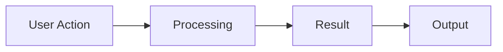

# Features

Explore the key features and capabilities of Platform-M.

:::tip Template Section
Document your platform's features here. For each feature:
- Explain what it does
- Show how to use it
- Provide examples
- Link to related documentation
:::

## Feature 1: [Feature Name]

[Description of what this feature does and why it's useful]

### How to Use

1. [Step 1]
2. [Step 2]
3. [Step 3]

### Example

```javascript
// Example code demonstrating this feature
const example = {
  feature: "example",
  usage: "demonstration"
};
```

### Configuration Options

| Option | Type | Default | Description |
|--------|------|---------|-------------|
| `option1` | string | `"default"` | Description of option 1 |
| `option2` | boolean | `true` | Description of option 2 |
| `option3` | number | `100` | Description of option 3 |

---

## Feature 2: [Another Feature Name]

[Description of this feature]

### Use Cases

- **Use case 1:** [When you would use this]
- **Use case 2:** [Another scenario]
- **Use case 3:** [Yet another scenario]

### How It Works

[Explain the underlying mechanism]



---

## Feature 3: [Advanced Feature Name]

[Description of this advanced feature]

:::info Requirements
This feature requires:
- [Requirement 1]
- [Requirement 2]
:::

### Getting Started

[Quick start guide for this feature]

### Advanced Usage

[More complex scenarios and options]

---

## Feature Comparison

| Feature | Basic Plan | Pro Plan | Enterprise |
|---------|-----------|----------|------------|
| Feature 1 | ✅ | ✅ | ✅ |
| Feature 2 | ❌ | ✅ | ✅ |
| Feature 3 | ❌ | ❌ | ✅ |

## Learn More

- [Tutorials](./tutorials) - Hands-on guides
- [Best Practices](./best-practices) - Tips and recommendations
- [API Reference](./api-reference) - Technical details
