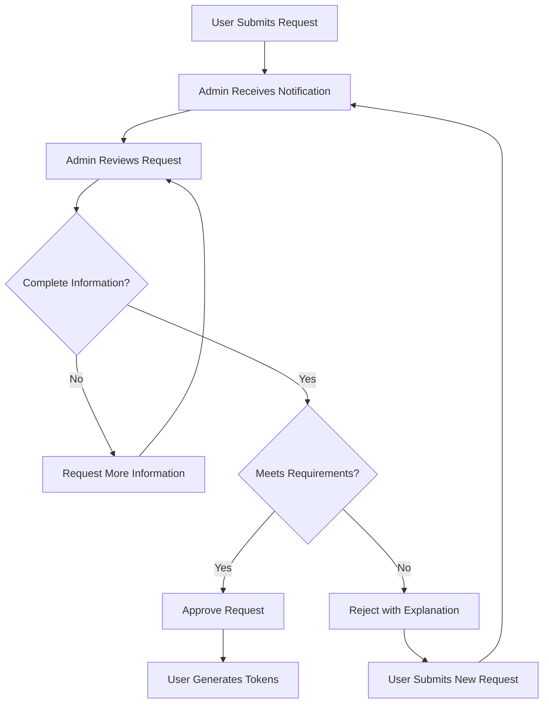

---
title: Manage requests
slug: /manage-requests
sidebar_label: "Manage requests"
sidebar_position: 2
description: "Learn how administrators review and approve pseudonymization requests"
---

# Manage Requests

Administrators are responsible for reviewing and approving pseudonymization requests before users can generate tokens. This guide explains the approval workflow.

## In this guide

- [Administrator responsibilities](#administrator-responsibilities)
- [View pending requests](#view-pending-requests)
- [Review a request](#review-a-request)
- [Approve requests](#approve-requests)
- [Reject requests](#reject-requests)
- [Best practices](#best-practices)

## Administrator responsibilities

As an administrator reviewing requests, you:

- **Verify legitimacy**: Ensure requests are appropriate and authorized
- **Check compliance**: Confirm requests meet regulatory requirements
- **Assess risk**: Evaluate data protection and privacy implications
- **Enable work**: Approve legitimate requests promptly
- **Provide feedback**: Give clear reasons when rejecting requests

Your role balances enabling data use with protecting privacy and ensuring compliance.

## View pending requests

### Access pending requests

1. Log in to the Pseudonymisation Portal
2. Navigate to:
   - **Admin Panel** > **Pending Requests**, or
   - **Requests** > filter by **Pending Approval**
3. View the list of requests awaiting your review

### Notifications

You receive notifications when:
- Users submit new requests
- Requests require your attention
- Requests are updated

Check notifications regularly to stay current on pending approvals.

### Request list information

The pending requests list typically shows:

- **Request name**: Identifier for the request
- **User**: Who submitted the request
- **organisation**: User's organisation
- **Project**: Associated project
- **Submission date**: When request was submitted
- **Priority**: Any urgency indicators

:::tip Sort and filter
Use sorting and filtering to prioritise:
- Oldest requests first
- Urgent requests
- Specific organisations
- Specific users
:::

## Review a request

Before approving or rejecting, thoroughly review each request.

### Step 1: Open the request

1. Select on the request from the pending list
2. Review the request details page

### Step 2: Review request information

Examine all details:

**Basic information:**
- Request name and description
- Purpose of pseudonymization
- Data to be pseudonymized
- Submission date and user

**Project settings:**
- Retention period
- Treatment setting (same/different token)
- Collaborating organisations
- Reversibility settings

**Organizational context:**
- Requesting user's organisation
- User's history and standing
- organisation's data handling practices

**Compliance considerations:**
- Regulatory requirements
- Data protection policies
- Organizational policies
- Legal agreements with collaborators

### Step 3: Verify appropriateness

Consider these questions:

**Legitimacy:**
- Is the request for a valid business purpose?
- Is the user authorized to make this request?
- Are the data sources appropriate?

**Privacy and security:**
- Are retention settings appropriate?
- Are collaborators properly configured?
- Is reversibility appropriately restricted?
- Does the request minimize data exposure?

**Compliance:**
- Does the request comply with regulations (GDPR, HIPAA, etc.)?
- Are data sharing agreements in place?
- Are required approvals obtained?

**Technical feasibility:**
- Is the pseudonymization approach appropriate?
- Are settings technically sound?
- Will the implementation work as intended?

### Step 4: Gather additional information (if needed)

If you need more information:

1. Contact the user directly
2. Review project documentation
3. Consult with data protection officers
4. Verify with organizational leadership

Don't approve requests you don't fully understand.

## Approve requests

When a request meets all requirements, approve it.

### Step 1: Confirm approval decision

Ensure:
- All review criteria are met
- Required information is complete
- You have authority to approve
- Any necessary external approvals are obtained

### Step 2: Approve the request

1. Select **Approve** on the request details page
2. Add approval notes (if required or appropriate)
3. Confirm the approval

**Expected outcome:**
- Request status changes to "Approved"
- User receives approval notification
- User can now generate tokens
- Request is logged in audit trail

### Approval notes

Include notes such as:
- Any conditions or requirements
- Compliance verification performed
- Expiration date (if applicable)
- Special instructions

### Communicate with user

After approval, consider:
- Confirming approval directly with user
- Providing any special instructions
- Clarifying expectations or limitations
- Offering support for implementation

## Reject requests

When a request doesn't meet requirements, reject it with clear explanation.

### Step 1: Determine rejection reason

Common reasons for rejection:

**Insufficient information:**
- Request lacks required details
- Purpose is unclear
- Data sources not specified

**Policy violations:**
- Doesn't comply with regulations
- Violates organizational policies
- Inappropriate data sharing

**Security concerns:**
- Inadequate security measures
- Inappropriate reversibility settings
- Concerning collaborators

**Authorization issues:**
- User not authorized for this data
- Missing required approvals
- organisation not approved for activity

**Technical issues:**
- Settings are incorrect
- Implementation won't work as intended
- Conflicts with existing requests

### Step 2: Reject the request

1. Select **Reject** or **Deny** on the request details page
2. **Select or enter rejection reason** (required)
3. **Provide detailed explanation**:
   - What's wrong with the request
   - What needs to be corrected
   - How user can resubmit successfully
4. Confirm the rejection

**Expected outcome:**
- Request status changes to "Rejected"
- User receives rejection notification with reason
- User can create a new request with corrections
- Rejection is logged in audit trail

### Rejection explanation best practices

**Be specific:**
❌ "Request doesn't meet requirements"
✅ "Retention period of 5 years exceeds organizational maximum of 2 years"

**Be helpful:**
❌ "Invalid collaborators"
✅ "Collaborator organisation key XYZ-123 doesn't exist. Please verify the key with your collaborator and resubmit."

**Be constructive:**
❌ "Not approved"
✅ "Request approved for 50,000 records, but you requested 500,000. Please split into multiple requests or justify the larger volume with data protection officer approval."

### Follow up

After rejection:
- Be available for questions
- Help user understand corrections needed
- Expedite review of resubmitted request
- Document lessons learned

## Common scenarios

### Request from new user

1. Verify user's authorization and training
2. Check organizational approval for user
3. Review request more carefully
4. Approve if all is in order
5. Consider providing guidance to new user

### Request with very long retention period

1. Review regulatory requirements
2. Check organizational policies
3. Verify business justification
4. Consider recommending shorter period
5. Approve only if truly necessary and compliant

### Request involving external collaborators

1. Verify data sharing agreements exist
2. Check collaborator organisations are approved
3. Review reversibility settings carefully
4. Confirm legal review completed
5. Approve only with proper documentation

### Request for sensitive data

1. Verify extra approvals obtained
2. Check enhanced security measures
3. Review audit logging enabled
4. Confirm compliance with special regulations
5. Document approval reasoning carefully

### Urgent request

1. Verify urgency is legitimate
2. Expedite review but don't skip steps
3. prioritise in your queue
4. Complete review promptly
5. Communicate status to user

## Approval workflow

## Best practices

### Timely reviews

- **Set review schedule**: Check pending requests daily or multiple times per day
- **prioritise appropriately**: Handle urgent requests first
- **Set expectations**: Communicate typical approval timeframes
- **Minimize delays**: Don't let requests sit unnecessarily

### Thorough evaluation

- **Check every field**: Don't skip any review criteria
- **Document reasoning**: Record why you approved or rejected
- **Consult when needed**: Seek input on complex requests
- **Stay current**: Keep up with policy and regulatory changes

### Clear communication

- **Detailed rejections**: Always explain specifically what's wrong
- **Helpful guidance**: Show users how to correct and resubmit
- **Availability**: Be accessible for questions
- **Consistency**: Apply standards uniformly

### Security and compliance

- **Verify compliance**: Ensure regulatory requirements are met
- **Protect data**: prioritise privacy and security
- **Audit trail**: Maintain clear records
- **Report issues**: Escalate concerning patterns

### Continuous improvement

- **Track metrics**: Monitor approval times and rejection rates
- **Identify patterns**: Note common issues
- **Update guidance**: Help users submit better requests
- **Share learnings**: Train users on common mistakes

## Metrics to monitor

Track these metrics to improve the process:

- **Average approval time**: How long from submission to decision
- **Rejection rate**: Percentage of requests rejected
- **Common rejection reasons**: What issues occur most frequently
- **Resubmission success**: Do corrected requests get approved
- **User feedback**: Are users satisfied with the process

## Troubleshooting

### Can't access a pending request

**Possible reasons:**
- Request was already processed by another admin
- Technical issue
- Insufficient permissions

**Solution:**
1. Refresh the page
2. Verify request is still pending
3. Check your admin permissions

### Approval doesn't complete

**Possible reasons:**
- Technical error
- Missing required fields
- System issue

**Solution:**
1. Verify all required fields in your approval
2. Try again
3. Contact technical support if persists

### User didn't receive notification

**Possible reasons:**
- Email issue
- User hasn't checked notifications
- Technical delay

**Solution:**
1. Check the request shows as approved in system
2. Ask user to check all notification locations
3. Consider contacting user directly

## Next steps

- Review [best practices](/user-guide/../best-practices) for administrators
- Learn about [managing organisations](/user-guide/manage-organisations)
- Check the [FAQ](/user-guide/../faq) for common administrative questions
