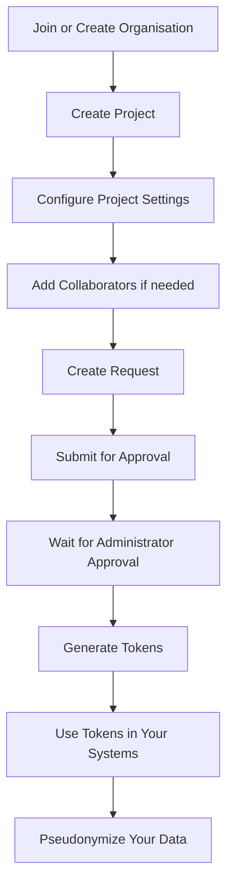

---
title: How it works
slug: /how-the-portal-works
sidebar_label: "How it works"
sidebar_position: 2
description: "Understand how the Pseudonymisation Portal works and what you can accomplish as a user"
---

# How the Portal Works

The Pseudonymisation Portal helps you protect sensitive data by replacing original values with pseudonymized tokens. This page explains the key components and your journey through the portal.

## What the portal does

The portal enables you to:

- **Protect sensitive data**: Replace identifiable information with pseudonymized values
- **Control data access**: Determine who can see original versus pseudonymized data
- **Enable collaboration**: Share pseudonymized data with other organisations securely
- **Maintain reversibility**: Convert pseudonymized data back to original values when needed (within set time limits)
- **Add privacy layers**: Re-pseudonymize data for additional protection

## Key components

Understanding these core elements helps you navigate the portal effectively.

### Organisations

An **organisation** represents your entity (hospital, research institution, department). Every user belongs to one organisation.

- **organisation key**: Your organisation's unique identifier for collaboration
- **Membership**: You work within your organisation's projects
- **Collaboration**: Share data with other organisations using their organisation keys

### Projects

A **project** organizes your pseudonymisation activities around a specific purpose or collaboration.

- **Settings**: Define how long data can be reversed (retention) and how repeated data is handled (treatment)
- **Collaborators**: Add other organisations who can access your pseudonymized data
- **Requests**: Submit pseudonymisation requests within the project
- **Ownership**: Projects belong to your organisation

### Requests

A **request** represents a specific dataset you want to pseudonymize.

- **Approval workflow**: Requests require administrator approval before token generation
- **Inherited settings**: Each request uses the project's retention and treatment settings
- **Multiple requests**: Create multiple requests within one project for different datasets

### Tokens

**Tokens** are the cryptographic keys that perform pseudonymization.

- **Pseudonymization tokens**: Convert original data to pseudonymized values
- **Reverse tokens**: Convert pseudonymized data back to original values
- **Secondary tokens**: Re-pseudonymize already pseudonymized data
- **Authorization tokens**: Authenticate your requests to the backend service

## Your journey through the portal

Here's what you do as a regular user:

### 1. Join or create an organisation

Before you begin, you need to belong to an organisation. As a regular user:

- **Create one organisation**: Submit a request to create an organisation (requires administrator approval)
- **Wait for assignment**: An administrator assigns you to an organisation
- **Receive organisation key**: Once approved, you get your organisation's unique key

### 2. Create a project

Projects organize your work:

- Define the project's purpose
- Set retention period (how long you can reverse data)
- Choose treatment (same or different tokens for repeated data)
- Add collaborating organisations if sharing data

### 3. Add collaborators (optional)

If other organisations need access to your pseudonymized data:

- Obtain their organisation keys
- Add them to your project
- Specify whether they can reverse data to original values

### 4. Create and submit a request

For each dataset you want to pseudonymize:

- Create a request within your project
- Describe what data you're pseudonymizing
- Submit for administrator approval
- Track the request status

### 5. Generate tokens

After your request is approved:

- Generate the appropriate token type:
  - **Pseudonymization token**: For initial data protection
  - **Reverse token**: For accessing original values (within retention period)
  - **Secondary token**: For additional privacy layers
- Receive authorization token with pseudonymization tokens
- Store tokens securely

### 6. Use tokens to pseudonymize data

Integrate tokens with your technical systems:

- Pass tokens to the backend pseudonymization service
- Process your data through the service
- Receive pseudonymized data
- Share or use the protected data

## What you can do

As a regular user, the portal enables you to:

**Protect your data**
- Pseudonymize sensitive information before sharing or storing
- Control the level of protection based on your needs

**Collaborate securely**
- Share pseudonymized data with trusted partners
- Maintain control over who can access original values

**Verify when needed**
- Reverse pseudonymized data during the retention period
- Perform quality checks and audits
- Access original values for legitimate purposes

**Add protection layers**
- Generate secondary tokens for third-party sharing
- Prevent correlation between datasets
- Ensure recipients cannot access source data

**Track your work**
- View all your projects and requests
- Monitor token generation and usage
- Maintain audit trails

## Important limitations

Be aware of these constraints:

- **One organisation**: Regular users can create and belong to only one organisation
- **Approval required**: Creating organisations and generating tokens require administrator approval
- **Retention limits**: After the retention period expires, you cannot reverse pseudonymized data
- **No deletion**: Projects and organisations cannot be deleted, only archived

## Next steps

Explore detailed information about each component:

- Learn about [Organisations](/user-guide/create-organisation) and organisation keys
- Understand [Projects](/user-guide/create-project) and their settings
- Discover [Token types](/user-guide/tokens) and their uses
- See [What is pseudonymisation](/user-guide/what-is-pseudonymisation) for technical background
