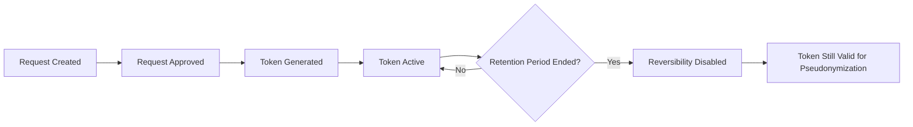

---
title: Tokens
slug: /tokens
sidebar_label: "Tokens"
sidebar_position: 3
description: "Learn about different token types and how to use them for pseudonymization"
---

# Tokens

Tokens are the key output of the Pseudonymisation Portal. Understanding token types helps you choose the right approach for your data protection needs.

## In this guide

- [What are tokens](#what-are-tokens)
- [Token types](#token-types)
- [Token type comparison](#token-type-comparison)
- [Token lifecycle](#token-lifecycle)

## What are tokens

Tokens are cryptographic values used to pseudonymize data. When you apply a token to your data:

- Original values are replaced with pseudonymized values
- The relationship between original and pseudonymized values is secured
- You can control who can reverse the pseudonymization
- Tokens integrate with your technical infrastructure

Tokens themselves don't contain data—they're keys used by backend services to perform pseudonymization.

## Token types

The portal supports three token types, each serving different purposes:

### Pseudonymization token

The standard token for pseudonymizing data.

**How it works:**
- Replaces original values with pseudonymized values
- Example: `AB` becomes `XY`
- Can be reversed if permitted

**When to use:**
- Initial data pseudonymization
- Standard data sharing scenarios
- When reversibility is needed

**After generation:**
You also receive an **authorization token** that authenticates your pseudonymization requests to the backend service.

### Reverse token

Converts pseudonymized values back to original values.

**How it works:**
- Takes pseudonymized values as input
- Returns original values
- Example: `XY` reveals `AB`
- Only works within the retention period
- Requires proper permissions

**When to use:**
- Data verification
- Audit processes
- Legitimate access to original data
- Within the configured retention period

:::warning Reversibility restrictions
- Reverse tokens only work during the retention period
- Only authorized organisations can reverse data
- After retention expires, reversal is permanently blocked
:::

### Secondary token

Pseudonymizes already pseudonymized data for additional privacy.

**How it works:**
- Takes pseudonymized values as input
- Produces a new layer of pseudonymization
- Example: `XY` becomes `123`
- Prevents access to original data
- Reversing reveals only the intermediate value, not the original

**When to use:**
- Sharing data with third parties
- Additional privacy protection
- Preventing correlation with original data
- When the recipient shouldn't access source data

**Requirements:**
To generate a secondary token, you must know:
- The source organisation (data owner)
- The source organisation's token
- The source data's pseudonymized form

:::info Secondary token reversibility
If you reverse a secondary token (`123`), you only reveal the intermediate value (`XY`), not the original value (`AB`). The original remains protected.
:::

## Token type comparison

| Feature | Pseudonymization Token | Reverse Token | Secondary Token |
|---------|----------------------|---------------|-----------------|
| **Purpose** | Pseudonymize original data | Reveal original data | Re-pseudonymize pseudonymized data |
| **Input** | Original data | Pseudonymized data | Pseudonymized data |
| **Output** | Pseudonymized data | Original data | Secondary pseudonymized data |
| **Reversibility** | Yes (with reverse token) | N/A | Yes (to first pseudonymization only) |
| **Use case** | Initial sharing | Verification, audit | Third-party sharing |

## Token lifecycle

Tokens remain valid throughout your project, but their reversibility may be limited by retention periods:

**Key points:**
- Tokens remain valid for pseudonymization operations indefinitely
- Reversibility expires after the configured retention period
- After retention expires, reverse tokens no longer work
- Secondary tokens continue to work but only reveal intermediate values

## Next steps

- Learn how to [generate tokens](/user-guide/generate-tokens) step by step
- Understand how to [create projects](/user-guide/create-project)
- Review [how the portal works](/user-guide/how-it-works) for the complete workflow
