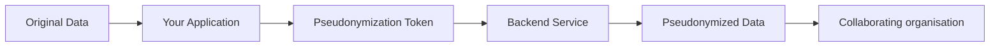

---
title: What is pseudonymisation?
slug: /what-is-pseudonymisation
sidebar_label: "What is pseudonymisation?"
sidebar_position: 1
description: "Learn about pseudonymisation and why organisations use it for data collaboration"
---

# What is Pseudonymisation?

Pseudonymisation is a data protection technique that replaces identifying information with artificial identifiers or pseudonyms, making it difficult to identify individuals without additional information.

## In this guide

- [Why pseudonymisation matters](#why-pseudonymisation-matters)
- [How the portal works](#how-the-portal-works)
- [Common use cases](#common-use-cases)

## Why pseudonymisation matters

organisations often need to share data for legitimate purposes, such as:

- Hospitals sharing patient data with research institutions
- Healthcare providers collaborating on clinical studies
- organisations contributing to public health initiatives
- Companies sharing customer insights across departments

When sharing data that contains personally identifiable information (PII), organisations must protect individual privacy while maintaining the data's usefulness. Pseudonymisation enables this by:

- **Protecting PII**: Replacing identifiable information with tokens
- **Enabling collaboration**: Allowing organisations to work together securely
- **Maintaining compliance**: Meeting data protection regulations
- **Preserving data utility**: Keeping data useful for analysis

## How the portal works

The Pseudonymisation Portal acts as a token generation interface:

1. **You create projects** in the portal to organize your pseudonymization needs
2. **You submit requests** to pseudonymize specific data sets
3. **You generate tokens** after requests are approved
4. **Backend services** (provided by INCERT) perform the actual pseudonymization
5. **You use the tokens** within your own technical infrastructure

:::info
The portal doesn't perform pseudonymization itself—it generates tokens that your organisation uses with backend pseudonymization services. How you integrate these tokens depends on your technical stack and requirements.
:::

### What happens to your data

The portal provides the token (C), which you use to connect your application with the backend service that performs the pseudonymization.

## Common use cases

### Research collaboration

A hospital wants to share patient data with a research institution for a clinical study. They create a project, generate tokens, and pseudonymize patient identifiers before sharing the data.

### Cross-organizational analysis

Multiple healthcare providers want to analyse treatment outcomes across their facilities. They create a project with all providers as collaborators and use pseudonymization tokens to protect patient identity while aggregating data.

### Secondary data use

An organisation collected data for one purpose but wants to use it for another. They pseudonymize the data to protect the original subjects' privacy while enabling the new analysis.

## Next steps

- Learn about [organisations and organisation keys](/user-guide/create-organisation)
- Understand [projects and collaboration](/user-guide/projects)
- Explore [token types and their uses](/user-guide/tokens)
